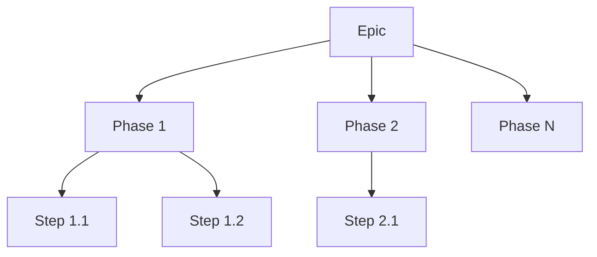
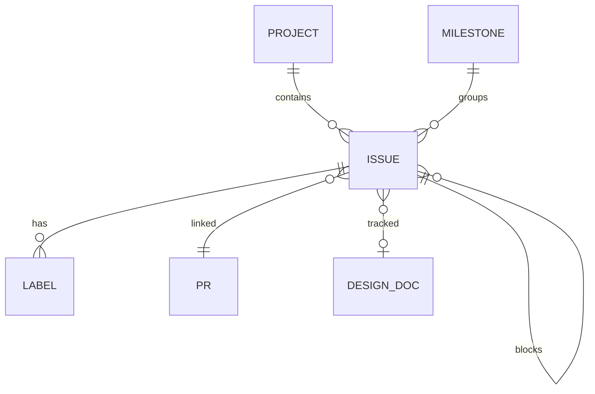

# GitHub Metadata Taxonomy

> **Status**: Draft
> **Author**: ktinubu@
> **Last Updated**: 2026-03-19

______________________________________________________________________

### Index

| §   | Section                                                        | What it covers                                              |
| --- | -------------------------------------------------------------- | ----------------------------------------------------------- |
| 1   | [Overview](#1-overview)                                        | How GitHub metadata organizes work in this repo             |
| 2   | [Projects](#2-projects)                                        | User-level GitHub Projects V2, fields, status workflow      |
| 3   | [Labels](#3-labels)                                            | Labels across 4 categories — domain, priority, status, type |
| 4   | [Milestones](#4-milestones)                                    | Milestones mapping to product releases                      |
| 5   | [Epics](#5-epics)                                              | Umbrella issues grouping phases and steps                   |
| 6   | [Parent-Child Relationships](#6-parent-child-relationships)    | Native sub-issues                                           |
| 7   | [Phase/Step Convention](#7-phasestep-convention)               | Unified Phase/Step hierarchy, decoupled from PRs            |
| 8   | [Blocking & Dependencies](#8-blocking--dependencies)           | Blocked label, body-text conventions, critical paths        |
| 9   | [Priority Tiers](#9-priority-tiers)                            | P0–P3 distribution by domain                                |
| 10  | [Cross-Project Issue Sharing](#10-cross-project-issue-sharing) | Issues that appear in multiple projects                     |
| 11  | [Design Doc ↔ Issue Linkage](#11-design-doc--issue-linkage)    | How design docs reference and track GitHub issues           |
| 12  | [Entity-Relationship Model](#12-entity-relationship-model)     | How all metadata types relate to each other                 |
| 13  | [Open Items](#13-open-items)                                   | Remaining gaps — deferred or pending                        |

______________________________________________________________________

## 1. Overview

synth-permutations organizes work across GitHub Projects V2 (user-level), milestones, labels, and epic issues. Two active work streams — the **data pipeline** (#74) and the **evaluation pipeline** (#98/#99) — drive the majority of tracked work. A third work stream — **training pipeline** (#107) — is at the brain dump stage.

Each work stream follows a consistent pattern: **design doc → epic issue → phases/steps → sub-issues**, with blocking relationships encoded via labels and issue body conventions. Projects provide board views with status tracking (Todo → In Progress → Done), while milestones tie issues to release targets.

## 2. Projects

User-level GitHub Projects V2, all linked to the repo:

| #   | Project         | Custom Fields Beyond Defaults                     |
| --- | --------------- | ------------------------------------------------- |
| 1   | CI & Automation | Priority, Start Date, Target Date                 |
| 2   | Data Pipeline   | Phase, Priority, v 1.0.0, Start Date, Target Date |
| 3   | Code Health     | Priority, Start Date, Target Date                 |
| 4   | Evaluation      | Phase, Priority, Start Date, Target Date          |
| 5   | Training        | Priority                                          |

### Default fields (all projects)

Every project includes these built-in fields:

- **Title**, **Assignees**, **Labels**, **Linked pull requests**, **Milestone**, **Repository**, **Reviewers**
- **Status** — single-select: `Todo` → `In Progress` → `Done`
- **Parent issue** — native GitHub sub-issue tracking
- **Sub-issues progress** — auto-computed from sub-issue states

### Status workflow

```
Todo  ──→  In Progress  ──→  Done
  ↑            │
  └────────────┘  (re-blocked)
  ↺ blocked label
```

Projects are **user-level** (owned by `ktinubu`, not the repo). Access them via:

```bash
gh project list --owner ktinubu
gh project view <number> --owner ktinubu
```

## 3. Labels

Labels organized into 4 categories:

| Category           | Labels                                                                               |
| ------------------ | ------------------------------------------------------------------------------------ |
| **Domain**         | `data-pipeline`, `ci-automation`, `code-health`, `evaluation`, `testing`, `training` |
| **Priority**       | `P0 🔴`, `P1 🟠`, `P2 🟡`, `P3 🔵`                                                   |
| **Status**         | `bug`, `duplicate`, `invalid`, `wontfix`, `blocked`                                  |
| **Feature / Type** | `enhancement`, `documentation`, `good first issue`, `help wanted`, `question`        |

### Domain labels

| Label           | Color   | Description                                   | Project |
| --------------- | ------- | --------------------------------------------- | ------- |
| `data-pipeline` | #0e8a16 | Data Pipeline project                         | #2      |
| `ci-automation` | #1d76db | CI & Automation project                       | #1      |
| `code-health`   | #fbca04 | Code Health project                           | #3      |
| `evaluation`    | #C5DEF5 | Evaluation pipeline, metrics, and inference   | #4      |
| `testing`       | #0E8A16 | Test infrastructure, fixtures, CI test config | #1      |
| `training`      | #8B5CF6 | Training pipeline, ops, and infrastructure    | #5      |

### Priority labels

| Label   | Color   | Usage                            |
| ------- | ------- | -------------------------------- |
| `P0 🔴` | #B60205 | Critical                         |
| `P1 🟠` | #D93F0B | High — foundation, core stages   |
| `P2 🟡` | #FBCA04 | Medium — Docker, E2E, production |
| `P3 🔵` | #0075CA | Low — nice-to-have               |

### Status/Workflow labels

| Label       | Color   | Description                       |
| ----------- | ------- | --------------------------------- |
| `bug`       | #d73a4a | Something isn't working           |
| `duplicate` | #cfd3d7 | This issue or pull request exists |
| `invalid`   | #e4e669 | This doesn't seem right           |
| `wontfix`   | #ffffff | This will not be worked on        |
| `blocked`   | #B60205 | Blocked by another issue          |

### Feature/Type labels

| Label              | Color   | Description                       |
| ------------------ | ------- | --------------------------------- |
| `enhancement`      | #a2eeef | New feature or request            |
| `documentation`    | #0075ca | Improvements or additions to docs |
| `good first issue` | #7057ff | Good for newcomers                |
| `help wanted`      | #008672 | Extra attention is needed         |
| `question`         | #d876e3 | Further information is requested  |

## 4. Milestones

| Milestone            | Work Stream     |
| -------------------- | --------------- |
| data-pipeline v1.0.0 | Data Pipeline   |
| evaluation v1.0.0    | Evaluation      |
| training v1.0.0      | Training        |
| ci-automation v1.0.0 | CI & Automation |
| code-health v1.0.0   | Code Health     |

Every work stream has a milestone.

## 5. Epics

Epics are umbrella issues that group related phases, steps, or sub-issues. Each has a corresponding design doc:

| Epic | Title                                                      | Project         | Design Doc                           |
| ---- | ---------------------------------------------------------- | --------------- | ------------------------------------ |
| #74  | feat(pipeline): distributed data pipeline                  | Data Pipeline   | `data-pipeline.md`                   |
| #98  | feat(eval): evaluation pipeline — predict, render, metrics | Evaluation      | `eval-pipeline.md` (PR #101)         |
| #99  | feat(storage): R2 integration for datasets and checkpoints | Eval + Pipeline | `eval-pipeline.md` §6                |
| #107 | feat(training): training pipeline & ops                    | Training        | `training-ops-braindump.md` (PR #84) |

### Hierarchy pattern

Every work stream follows the same structure:



For the full hierarchy of each work stream, see the corresponding design doc or implementation plan.

## 6. Parent-Child Relationships

All 5 projects include the **Parent issue** and **Sub-issues progress** fields. GitHub natively tracks these relationships and auto-computes progress bars.

## 7. Phase/Step Convention

All work streams use a unified **Phase / Step** hierarchy:

- **Phase** — a large feature or functional area (e.g., "Pipeline Core", "Portable Stages"). Each phase is a GitHub issue and a sub-issue of its epic.
- **Step** — a testable unit of work within a phase (e.g., "Schema validation", "rclone wrapper"). Each step is a GitHub issue and a sub-issue of its phase.
- **PR** — a shipping unit, orthogonal to the hierarchy. A PR may contain one step, multiple small steps, or part of a large step. PRs are not prescribed by the plan — they're decided at implementation time based on what makes sense to review and merge together.

### Naming

- Phases: `Phase N: Name` (e.g., "Phase 2: Pipeline Core")
- Steps: `Step N.M: Name` (e.g., "Step 2.1: Schemas")
- Step numbering reflects position within a phase, not PR boundaries

### Project fields

Both the Data Pipeline and Evaluation projects have a **Phase** single-select field for grouping and filtering in project views.

### Merge path

```
main ──●──────────●────────────●──────────●──────────●──────────●──→
       │          │            │          │          │          │
    Phase 1    Phase 2      Phase 3    Phase 4    Phase 5    Phase 6
```

All PRs merge to `main`. Phase ordering defines the dependency chain, but PRs within a phase can land in any order as long as steps are independently testable.

## 8. Blocking & Dependencies

### Conventions

- **`blocked` label** — applied to issues that cannot start yet
- **`## Blocked by` section** in issue body — lists specific issue numbers
- **Design doc dependency graphs** — ASCII art and blocking matrices in design docs
- **File-overlap sequencing** — within the same work stream, steps that modify the same files should be sequenced to avoid merge conflicts. This doesn’t require the `blocked` label — just coordinate the PR order.

### Critical paths

Each work stream’s design doc defines a dependency DAG. The critical path determines which phases must complete before others can start:

- **Data pipeline:** Phase 1 → Phase 2 → {Phase 3, Phase 4} → Phase 5 → Phase 6
- **Eval pipeline:** #94 → #85 → #88 → #89 (4-step critical path)

For detailed blocking matrices and parallel execution windows, see the respective design docs.

### Blocked issue count

Issues carrying the `blocked` label span both the data pipeline and eval pipeline work streams.

## 9. Priority Tiers

| Priority | Typical usage                          |
| -------- | -------------------------------------- |
| P0 🔴    | Critical                               |
| P1 🟠    | Foundation phases, core stages, rclone |
| P2 🟡    | Docker, E2E, production, consolidation |
| P3 🔵    | Nice-to-have (W&B metrics, seeding)    |

Priority labels are concentrated on pipeline and eval work.

## 10. Cross-Project Issue Sharing

Some issues appear in multiple projects for cross-cutting visibility:

| Issues   | Projects                        | Reason                            |
| -------- | ------------------------------- | --------------------------------- |
| #76, #77 | Data Pipeline + CI & Automation | Cross-cutting testing/reliability |
| #90–#93  | Data Pipeline + Evaluation      | R2 integration shared across both |
| #78–#82  | Data Pipeline + CI & Automation | Phase 1 steps include CI setup    |

This is intentional — cross-cutting work should be visible on relevant boards. The risk is **status drift** if an issue's status is updated on one board but not the other. GitHub Projects V2 shares a single status field, so this is not an issue in practice.

## 11. Design Doc ↔ Issue Linkage

Design docs and GitHub issues are cross-referenced through several conventions:

### In design doc headers

```markdown
> **Tracking**: #98 (eval epic), #99 (R2 epic)
```

### In implementation plan index tables

```markdown
| §   | Section                                         | GitHub issue |
| --- | ----------------------------------------------- | ------------ |
| 5   | [Phase 1 — Foundation](#5-phase-1--foundation)  | #68          |
```

### In issue bodies

Issues reference design doc sections:

```markdown
**Design doc:** data-pipeline.md §7.1 (Storage as truth)
```

### Completion tracking

The implementation plan tracks step completion inline:

```markdown
### Step 1.1: Dependencies & Tooling (#78) ✅
**Completed in PR #75.**
```

### Dependency visualization

The eval pipeline design doc (§8) includes:

- ASCII dependency graphs
- Blocking matrices (tabular)
- Timeline visualizations with parallel execution windows

The data pipeline implementation plan includes:

- ASCII merge-path diagrams
- Phase/step tables with CI gates

## 12. Entity-Relationship Model

How all metadata types relate to each other:



### Project field comparison

| Field               | CI  | Data Pipeline | Code Health | Evaluation | Training |
| ------------------- | --- | ------------- | ----------- | ---------- | -------- |
| Status              | ✅  | ✅            | ✅          | ✅         | ✅       |
| Priority            | ✅  | ✅            | ✅          | ✅         | ✅       |
| Parent issue        | ✅  | ✅            | ✅          | ✅         | ✅       |
| Sub-issues progress | ✅  | ✅            | ✅          | ✅         | ✅       |
| Start Date          | ✅  | ✅            | ✅          | ✅         | —        |
| Target Date         | ✅  | ✅            | ✅          | ✅         | —        |
| Phase               | —   | ✅            | —           | ✅         | —        |
| v 1.0.0             | —   | ✅            | —           | —          | —        |

### Issue lifecycle

When an issue is created:

1. Add labels (domain, priority, type)
2. Assign to a milestone
3. Add to the relevant project (Status: **Todo**)
4. If blocked, add the `blocked` label
5. When work starts, move to **In Progress**
6. Link the PR
7. When the PR merges, move to **Done** and close the issue

## 13. Open Items

| #   | Item                          | Status   | Notes                                                             |
| --- | ----------------------------- | -------- | ----------------------------------------------------------------- |
| G3  | P0 label unused               | Deferred | Keep until a critical incident needs it                           |
| G4  | Blocking not machine-readable | Deferred | `## Blocked by` body-text remains; GitHub may add native blocking |
