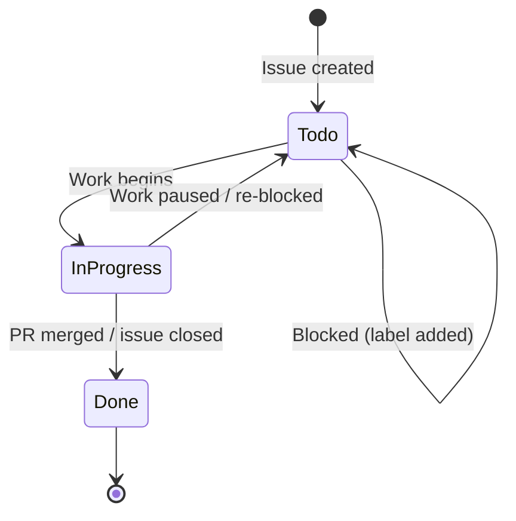
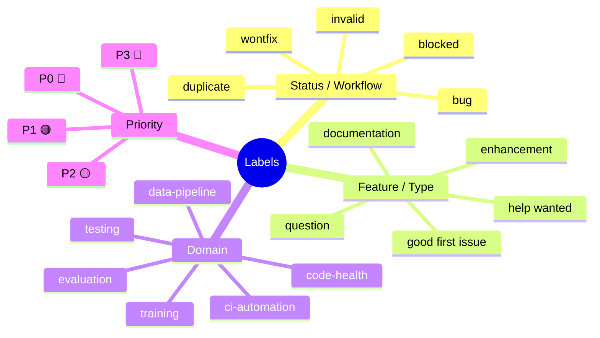
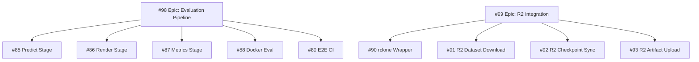
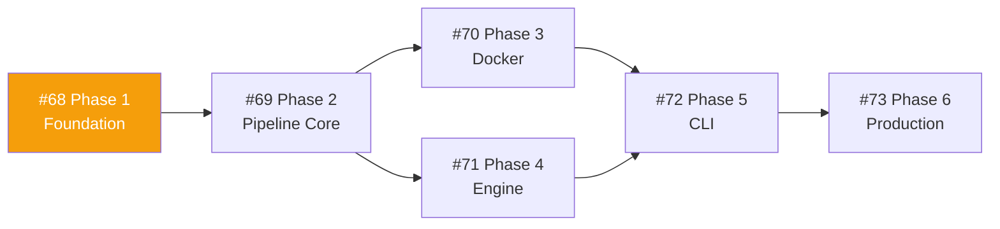
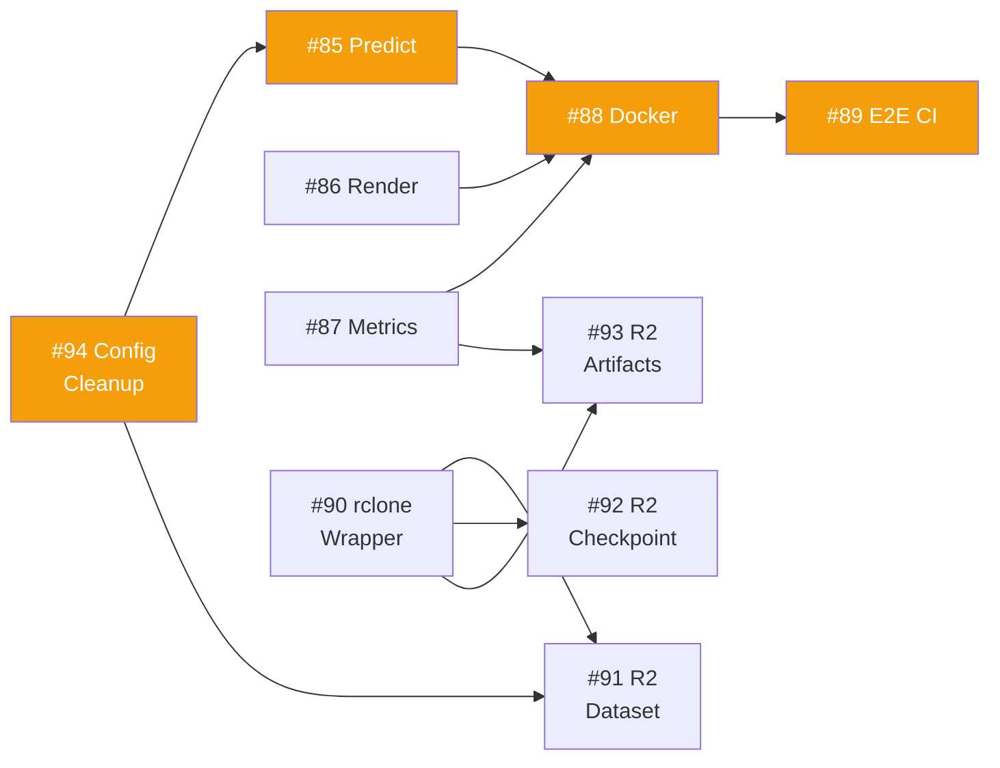
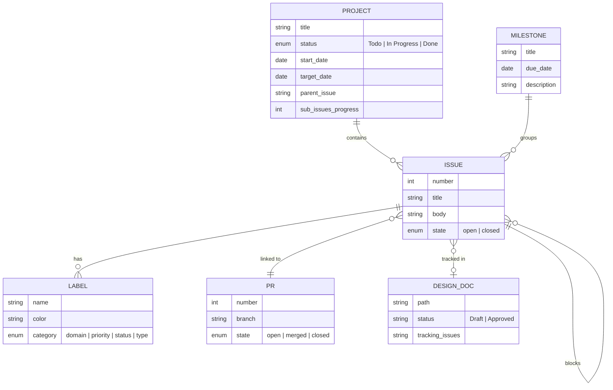
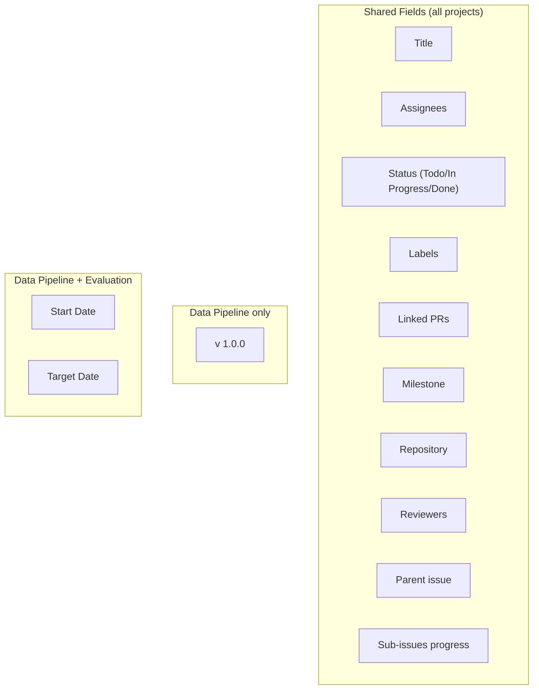
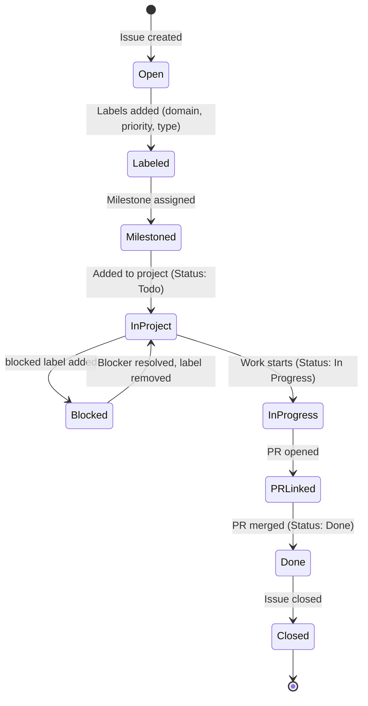

# GitHub Metadata Taxonomy

> **Status**: Draft
> **Author**: ktinubu@
> **Last Updated**: 2026-03-19

______________________________________________________________________

### Index

| §   | Section                                                                               | What it covers                                                 |
| --- | ------------------------------------------------------------------------------------- | -------------------------------------------------------------- |
| 1   | [Overview](#1-overview)                                                               | How GitHub metadata organizes work in this repo                |
| 2   | [Projects](#2-projects)                                                               | 5 user-level GitHub Projects V2, fields, status workflow       |
| 3   | [Labels](#3-labels)                                                                   | 20 labels across 5 categories — domain, priority, status, type |
| 4   | [Milestones](#4-milestones)                                                           | 5 milestones mapping to product releases                       |
| 5   | [Epics](#5-epics)                                                                     | Umbrella issues grouping phases and steps                      |
| 6   | [Parent-Child Relationships](#6-parent-child-relationships)                           | Native sub-issues and body-text conventions                    |
| 7   | [Phase/Step Naming & Implementation Plans](#7-phasestep-naming--implementation-plans) | Two planning conventions across work streams                   |
| 8   | [Blocking & Dependencies](#8-blocking--dependencies)                                  | Blocked label, body-text conventions, critical paths           |
| 9   | [Priority Tiers](#9-priority-tiers)                                                   | P0–P3 distribution by domain                                   |
| 10  | [Cross-Project Issue Sharing](#10-cross-project-issue-sharing)                        | Issues that appear in multiple projects                        |
| 11  | [Design Doc ↔ Issue Linkage](#11-design-doc--issue-linkage)                           | How design docs reference and track GitHub issues              |
| 12  | [Entity-Relationship Model](#12-entity-relationship-model)                            | How all metadata types relate to each other                    |
| 13  | [Gap Analysis](#13-gap-analysis)                                                      | Inconsistencies, missing metadata, recommendations             |
| 14  | [Proposed Target Taxonomy & Migration](#14-proposed-target-taxonomy--migration)       | Concrete changes to improve consistency                        |

______________________________________________________________________

## 1. Overview

synth-permutations organizes work across five GitHub Projects V2 (user-level), five milestones, 20 labels, and four epic issues. Two active work streams — the **data pipeline** (#74) and the **evaluation pipeline** (#98/#99) — drive the majority of tracked work. A third work stream — **training pipeline** (#107) — is at the brain dump stage.

Each work stream follows a consistent pattern: **design doc → epic issue → phases/steps → sub-issues**, with blocking relationships encoded via labels and issue body conventions. Projects provide board views with status tracking (Todo → In Progress → Done), while milestones tie issues to release targets.

## 2. Projects

Five user-level GitHub Projects V2, all linked to the repo:

| #   | Project         | Items | Custom Fields Beyond Defaults    |
| --- | --------------- | ----- | -------------------------------- |
| 1   | CI & Automation | 29    | —                                |
| 2   | Data Pipeline   | 34    | v 1.0.0, Start Date, Target Date |
| 3   | Code Health     | 15    | —                                |
| 4   | Evaluation      | 15    | Start Date, Target Date          |
| 5   | Training        | 1     | *(new — skeleton, fields TBD)*   |

### Default fields (all projects)

Every project includes these built-in fields:

- **Title**, **Assignees**, **Labels**, **Linked pull requests**, **Milestone**, **Repository**, **Reviewers**
- **Status** — single-select: `Todo` → `In Progress` → `Done`
- **Parent issue** — native GitHub sub-issue tracking
- **Sub-issues progress** — auto-computed from sub-issue states

### Status workflow



Projects are **user-level** (owned by `ktinubu`, not the repo). Access them via:

```bash
gh project list --owner ktinubu
gh project view <number> --owner ktinubu
```

## 3. Labels

20 labels organized into 5 categories:



### Domain labels

| Label           | Color   | Description                                   | Project |
| --------------- | ------- | --------------------------------------------- | ------- |
| `data-pipeline` | #0e8a16 | Data Pipeline project                         | #2      |
| `ci-automation` | #1d76db | CI & Automation project                       | #1      |
| `code-health`   | #fbca04 | Code Health project                           | #3      |
| `evaluation`    | #C5DEF5 | Evaluation pipeline, metrics, and inference   | #4      |
| `testing`       | #0E8A16 | Test infrastructure, fixtures, CI test config | #1      |
| `training`      | #8B5CF6 | Training pipeline, ops, and infrastructure    | #5      |

### Priority labels

| Label   | Color   | Issues | Usage                            |
| ------- | ------- | ------ | -------------------------------- |
| `P0 🔴` | #B60205 | 0      | Critical — unused *(see §13)*    |
| `P1 🟠` | #D93F0B | 15     | High — foundation, core stages   |
| `P2 🟡` | #FBCA04 | 12     | Medium — Docker, E2E, production |
| `P3 🔵` | #0075CA | 2      | Low — nice-to-have               |

### Status/Workflow labels

| Label       | Color   | Description                       |
| ----------- | ------- | --------------------------------- |
| `bug`       | #d73a4a | Something isn't working           |
| `duplicate` | #cfd3d7 | This issue or pull request exists |
| `invalid`   | #e4e669 | This doesn't seem right           |
| `wontfix`   | #ffffff | This will not be worked on        |
| `blocked`   | #B60205 | Blocked by another issue          |

### Feature/Type labels

| Label              | Color   | Description                       |
| ------------------ | ------- | --------------------------------- |
| `enhancement`      | #a2eeef | New feature or request            |
| `documentation`    | #0075ca | Improvements or additions to docs |
| `good first issue` | #7057ff | Good for newcomers                |
| `help wanted`      | #008672 | Extra attention is needed         |
| `question`         | #d876e3 | Further information is requested  |

## 4. Milestones

| Milestone            | Due        | Issues | Work Stream     |
| -------------------- | ---------- | ------ | --------------- |
| data-pipeline v1.0.0 | 2026-03-30 | 17     | Data Pipeline   |
| evaluation v1.0.0    | 2026-04-14 | 16     | Evaluation      |
| training v1.0.0      | TBD        | 1      | Training        |
| ci-automation v1.0.0 | TBD        | 15     | CI & Automation |
| code-health v1.0.0   | TBD        | 8      | Code Health     |

Every work stream now has a milestone.

## 5. Epics

Epics are umbrella issues that group related phases, steps, or sub-issues. Each has a corresponding design doc:

| Epic | Title                                                      | Sub-issues | Project         | Design Doc                  |
| ---- | ---------------------------------------------------------- | ---------- | --------------- | --------------------------- |
| #74  | feat(pipeline): distributed data pipeline                  | 6 phases   | Data Pipeline   | `data-pipeline.md`          |
| #98  | feat(eval): evaluation pipeline — predict, render, metrics | 5 stages   | Evaluation      | `eval-pipeline.md`          |
| #99  | feat(storage): R2 integration for datasets and checkpoints | 4 pieces   | Eval + Pipeline | `eval-pipeline.md` §6       |
| #107 | feat(training): training pipeline & ops                    | TBD        | Training        | `training-ops-braindump.md` |

### Data pipeline epic hierarchy

```mermaid
graph TD
    E74["#74 Epic: Distributed Data Pipeline"]

    E74 --> P1["#68 Phase 1: Foundation"]
    E74 --> P2["#69 Phase 2: Pipeline Core"]
    E74 --> P3["#70 Phase 3: Docker"]
    E74 --> P4["#71 Phase 4: Pipeline Engine"]
    E74 --> P5["#72 Phase 5: Pipeline CLI"]
    E74 --> P6["#73 Phase 6: Production & E2E"]
    E74 --> XC1["#76 Cross-cutting: Testing"]
    E74 --> XC2["#77 Cross-cutting: Reliability"]

    P1 --> S11["#78 Step 1.1 ✅"]
    P1 --> S12["#79 Step 1.2"]
    P1 --> S13["#80 Step 1.3"]
    P1 --> S14["#81 Step 1.4"]

    P2 --> S21a["#18 Step 2.1a: Schemas"]
    P2 --> S21b["#20 Step 2.1b: Versioning"]
    P2 --> S21c["#22 Step 2.1c: Shard Assignment"]
    P2 --> S22["#102 Step 2.2: Storage"]
    P2 --> S23["#103 Step 2.3: Validation"]

    P3 --> S31["#7 Step 3.1: Docker"]

    P4 --> S41["#104 Step 4.1: Reconciliation"]
    P4 --> S42["#105 Step 4.2: Compute + Worker"]

    P5 --> S51["#17 CLI"]
    P5 --> S52["#19 WDS Output"]
    P5 --> S53["#21 Status Reporting"]

    P6 --> S61["#106 Step 6.1: RunPod + E2E"]

    style S11 fill:#22c55e,color:#fff
```



### Evaluation pipeline epic hierarchy



## 6. Parent-Child Relationships

All 5 projects include the **Parent issue** and **Sub-issues progress** fields. GitHub natively tracks these relationships and auto-computes progress bars.

A previous body-text convention (`**Parent:** #N` in issue bodies) has been retired in favor of native sub-issues.

## 7. Phase/Step Naming & Implementation Plans

Two different planning conventions are in use:

| Work Stream   | Convention          | Example                | Tracking Doc             |
| ------------- | ------------------- | ---------------------- | ------------------------ |
| Data Pipeline | Phase N · Step N.M  | Phase 2 · Step 2.1     | `implementation-plan.md` |
| Eval Pipeline | PR grouping (#1–#6) | PR #2: Portable Stages | `eval-pipeline.md` §12   |

### Data pipeline convention

- 6 sequential **phases** (#68–#73), each a GitHub issue
- 2 **cross-cutting** issues (#76, #77) outside the phase hierarchy
- Each phase contains **steps** (e.g., Step 2.1, Step 2.2), each a sub-issue with one PR per step
- Phase/Step naming: `Phase N (Name) · Step N.M`

### Eval pipeline convention

- 6 **PRs** grouping 2–3 issues each
- Internal phase numbering within PRs (e.g., "PR #1: Foundation → Phase 1: Remove Hardcoded Paths")
- Issues are not called "steps" — they're named by function (e.g., "Portable predict stage")

### Merge path (both work streams)

```
main ──●──────────●────────────●──────────●──────────●──────────●──→
       │          │            │          │          │          │
    Phase 1    Phase 2      Phase 3    Phase 4    Phase 5    Phase 6
```

One PR per step (data pipeline) or grouped PRs (eval pipeline), always merging to `main`.

## 8. Blocking & Dependencies

### Conventions

- **`blocked` label** — applied to issues that cannot start yet
- **`## Blocked by` section** in issue body — lists specific issue numbers
- **Design doc dependency graphs** — ASCII art in `eval-pipeline.md` §8, blocking matrix tables

### Data pipeline critical path



### Eval pipeline critical path



### Eval pipeline blocking matrix

| Issue | Title               | Blocked by    | Blocks                  |
| ----- | ------------------- | ------------- | ----------------------- |
| #94   | Config cleanup      | —             | #85, #91                |
| #85   | Portable predict    | #94           | #88, #89, #97           |
| #86   | Portable render     | —             | #88, #89, #97           |
| #87   | Portable metrics    | —             | #88, #89, #93, #96, #97 |
| #90   | rclone wrapper      | —             | #91, #92, #93           |
| #88   | Docker eval         | #85, #86, #87 | #89                     |
| #89   | E2E CI              | #85–#88       | —                       |
| #91   | R2 dataset download | #90, #94      | —                       |
| #92   | R2 checkpoint sync  | #90           | —                       |
| #93   | R2 artifact upload  | #90, #87      | —                       |

### Blocked issue count

18 issues currently carry the `blocked` label — 10 in the data pipeline and 8 in the eval pipeline.

## 9. Priority Tiers

| Priority | Count | Typical usage                          |
| -------- | ----- | -------------------------------------- |
| P0 🔴    | 0     | Critical — not yet used                |
| P1 🟠    | 15    | Foundation phases, core stages, rclone |
| P2 🟡    | 12    | Docker, E2E, production, consolidation |
| P3 🔵    | 2     | Nice-to-have (W&B metrics, seeding)    |
| None     | ~77   | CI, code health, older issues          |

### Priority by work stream

| Work Stream   | P1  | P2  | P3  | None |
| ------------- | --- | --- | --- | ---- |
| Data Pipeline | 6   | 5   | 1   | 22   |
| Evaluation    | 5   | 4   | 1   | 5    |
| CI            | 0   | 0   | 0   | 29   |
| Code Health   | 0   | 0   | 0   | 15   |
| Training      | 0   | 0   | 0   | 1    |

Priority labels are concentrated on pipeline/eval work. CI and Code Health issues have no priority assigned.

## 10. Cross-Project Issue Sharing

Some issues appear in multiple projects for cross-cutting visibility:

| Issues   | Projects                        | Reason                            |
| -------- | ------------------------------- | --------------------------------- |
| #76, #77 | Data Pipeline + CI & Automation | Cross-cutting testing/reliability |
| #90–#93  | Data Pipeline + Evaluation      | R2 integration shared across both |
| #78–#82  | Data Pipeline + CI & Automation | Phase 1 steps include CI setup    |

This is intentional — cross-cutting work should be visible on relevant boards. The risk is **status drift** if an issue's status is updated on one board but not the other. GitHub Projects V2 shares a single status field, so this is not an issue in practice.

## 11. Design Doc ↔ Issue Linkage

Design docs and GitHub issues are cross-referenced through several conventions:

### In design doc headers

```markdown
> **Tracking**: #98 (eval epic), #99 (R2 epic)
```

### In implementation plan index tables

```markdown
| §   | Section                                         | GitHub issue |
| --- | ----------------------------------------------- | ------------ |
| 5   | [Phase 1 — Foundation](#5-phase-1--foundation)  | #68          |
```

### In issue bodies

Issues reference design doc sections:

```markdown
**Design doc:** data-pipeline.md §7.1 (Storage as truth)
```

### Completion tracking

The implementation plan tracks step completion inline:

```markdown
### Step 1.1: Dependencies & Tooling (#78) ✅
**Completed in PR #75.**
```

### Dependency visualization

The eval pipeline design doc (§8) includes:

- ASCII dependency graphs
- Blocking matrices (tabular)
- Timeline visualizations with parallel execution windows

The data pipeline implementation plan includes:

- ASCII merge-path diagrams
- Phase/step tables with CI gates

## 12. Entity-Relationship Model

How all metadata types relate to each other:



### Project field comparison



### Issue lifecycle



## 13. Gap Analysis

| #   | Gap                                 | Severity  | Description                                                                      |
| --- | ----------------------------------- | --------- | -------------------------------------------------------------------------------- |
| G1  | `ci` vs `ci-automation` overlap     | **Fixed** | Deleted `ci` label, migrated 8 issues to `ci-automation`                         |
| G2  | No milestones for CI or Code Health | **Fixed** | Created `ci-automation v1.0.0` and `code-health v1.0.0` milestones               |
| G3  | P0 label unused                     | Deferred  | Keep until a critical incident needs it                                          |
| G4  | Blocking not machine-readable       | Deferred  | `## Blocked by` body-text convention remains; GitHub may add native blocking     |
| G5  | Dual parent-child conventions       | **Fixed** | Removed `**Parent:** #N` from 7 issue bodies; native sub-issues only             |
| G6  | Inconsistent planning conventions   | Open      | Data pipeline: Phase/Step; Eval: PR grouping — design decision pending           |
| G7  | Issues in multiple projects         | Accepted  | Intentional for cross-cutting visibility                                         |
| G8  | Inconsistent custom fields          | **Fixed** | Added Start Date / Target Date fields to CI & Code Health projects               |
| G9  | No issue templates                  | **Fixed** | Created `.github/ISSUE_TEMPLATE/` with epic, phase, step, and bug templates      |
| G10 | Priority coverage gaps              | **Fixed** | Added Priority single-select field to all 5 projects; values set on all items    |
| G11 | Eval blocking label mismatch        | **Fixed** | Added `blocked` label to 8 eval pipeline issues matching the design doc's matrix |

## 14. Changes Made (this PR)

### GitHub metadata changes (already applied)

- [x] Link Code Health (#3) and Evaluation (#4) projects to repo
- [x] Create Training project (#5) and link to repo
- [x] Create `training` label, `training v1.0.0` milestone, epic #107
- [x] Delete `ci` label, migrate 8 issues to `ci-automation` (G1)
- [x] Create `ci-automation v1.0.0` and `code-health v1.0.0` milestones (G2)
- [x] Assign milestones to all CI and Code Health issues (G2)
- [x] Remove `**Parent:** #N` from 7 issue bodies (G5)
- [x] Add Start Date / Target Date fields to CI & Code Health projects (G8)
- [x] Add Priority single-select field to all 5 projects, set values on all items (G10)
- [x] Add Phase single-select field to Data Pipeline project, set values on all 34 items
- [x] Add PR Group single-select field to Evaluation project, set values on all 15 items
- [x] Add `blocked` label to 8 eval pipeline issues (G11)

### Code changes (in this PR)

- [x] `docs/design/github-taxonomy.md` — this document
- [x] `.github/ISSUE_TEMPLATE/epic.yml` — epic issue template (G9)
- [x] `.github/ISSUE_TEMPLATE/phase.yml` — phase issue template (G9)
- [x] `.github/ISSUE_TEMPLATE/step.yml` — step issue template (G9)
- [x] `.github/ISSUE_TEMPLATE/bug.yml` — bug report template (G9)
- [x] `.github/ISSUE_TEMPLATE/config.yml` — template chooser config (G9)

### Remaining open items

| Item                         | Gap | Notes                                                           |
| ---------------------------- | --- | --------------------------------------------------------------- |
| Align planning conventions   | G6  | Design decision: adopt one scheme or document when to use which |
| Remove or repurpose P0 label | G3  | Keep until a critical incident needs it                         |
| Machine-readable blocking    | G4  | GitHub may add native blocking; wait and see                    |
