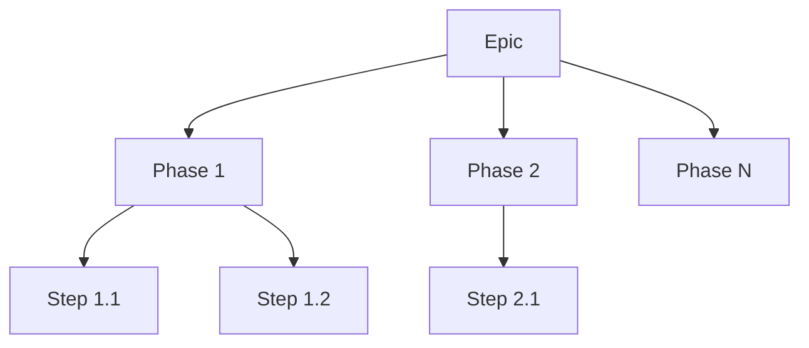
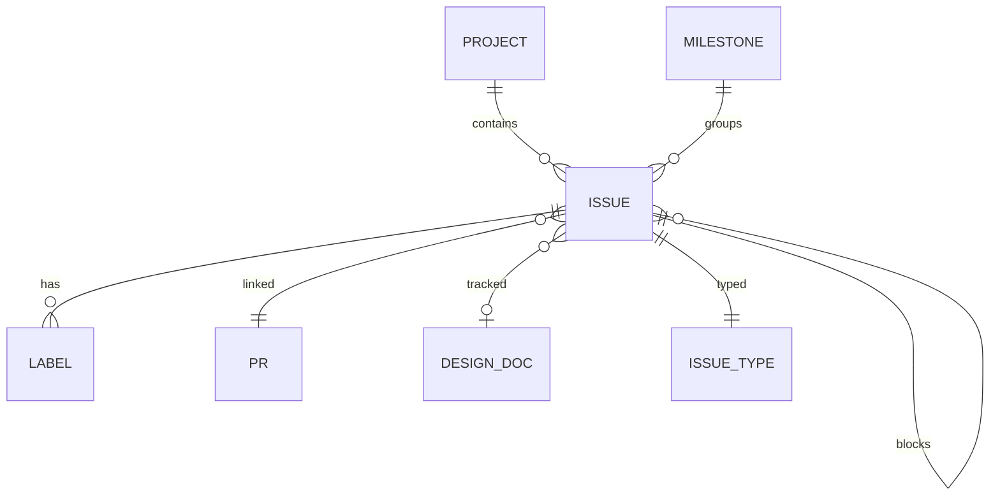

# GitHub Metadata Taxonomy

> **Status**: Draft
> **Author**: ktinubu@
> **Last Updated**: 2026-03-19

______________________________________________________________________

### Index

| §   | Section                                                        | What it covers                                        |
| --- | -------------------------------------------------------------- | ----------------------------------------------------- |
| 1   | [Overview](#1-overview)                                        | How GitHub metadata organizes work in this repo       |
| 2   | [Issue Types](#2-issue-types)                                  | Native Epic, Phase, Step, Bug classification          |
| 3   | [Projects](#3-projects)                                        | Org-level GitHub Projects V2, fields, status workflow |
| 4   | [Labels](#4-labels)                                            | Domain labels for work stream classification          |
| 5   | [Milestones](#5-milestones)                                    | Milestones mapping to product releases                |
| 6   | [Epics & Hierarchy](#6-epics--hierarchy)                       | Epic → Phase → Step via native sub-issues             |
| 7   | [Phase/Step Convention](#7-phasestep-convention)               | Unified Phase/Step hierarchy, decoupled from PRs      |
| 8   | [Blocking & Dependencies](#8-blocking--dependencies)           | Native blocking dependencies, critical paths          |
| 9   | [Priority](#9-priority)                                        | Priority via Issue Fields                             |
| 10  | [Cross-Project Issue Sharing](#10-cross-project-issue-sharing) | Issues that appear in multiple projects               |
| 11  | [Design Doc ↔ Issue Linkage](#11-design-doc--issue-linkage)    | How design docs reference and track GitHub issues     |
| 12  | [Entity-Relationship Model](#12-entity-relationship-model)     | How all metadata types relate to each other           |

______________________________________________________________________

## 1. Overview

synth-permutations organizes work using GitHub’s native issue tracking features: **Issue Types** (Epic, Phase, Step, Bug), **native blocking** dependencies, **sub-issues** for hierarchy, **Projects V2** for views, and **milestones** for release targets. Labels provide domain classification.

Each work stream follows: **design doc → Epic → Phases → Steps**, with blocking relationships tracked via GitHub’s native dependency system. Projects provide board, table, hierarchy, and roadmap views.

## 2. Issue Types

Issues are classified using GitHub’s native Issue Types (org-level):

| Type      | Purpose                                          | Example                                |
| --------- | ------------------------------------------------ | -------------------------------------- |
| **Epic**  | Umbrella issue grouping phases for a work stream | #74 distributed data pipeline          |
| **Phase** | Large feature area within an epic                | #69 Pipeline Core                      |
| **Step**  | Testable unit of work within a phase             | #102 storage layer                     |
| **Bug**   | Something isn’t working                          | #10 OmegaConf resolver re-registration |
| **Task**  | General work that doesn’t fit the above          | CI improvements, code health goals     |

Issue types replace naming conventions — the type is set on the issue itself, not inferred from the title prefix. Types are filterable in issue lists and show distinct icons.

## 3. Projects

Org-level GitHub Projects V2, linked to the repo:

| #   | Project         | Custom Fields Beyond Defaults                     |
| --- | --------------- | ------------------------------------------------- |
| 1   | CI & Automation | Priority, Start Date, Target Date                 |
| 2   | Data Pipeline   | Phase, Priority, v 1.0.0, Start Date, Target Date |
| 3   | Code Health     | Priority, Start Date, Target Date                 |
| 4   | Evaluation      | Phase, Priority, Start Date, Target Date          |
| 5   | Training        | Priority                                          |

### Default fields (all projects)

Every project includes these built-in fields:

- **Title**, **Assignees**, **Labels**, **Linked pull requests**, **Milestone**, **Repository**, **Reviewers**
- **Status** — single-select: `Todo` → `In Progress` → `Done`
- **Parent issue** — native GitHub sub-issue tracking
- **Sub-issues progress** — auto-computed from sub-issue states

### Status workflow

```
Todo  ──→  In Progress  ──→  Done
  ↑            │
  └────────────┘  (re-blocked)
```

### Hierarchy view

Projects support a **hierarchy view** that renders the Epic → Phase → Step tree directly in table views. Sub-issues can be expanded/collapsed up to 8 levels deep, and support drag-and-drop reordering.

## 4. Labels

Labels classify issues by **domain** (which work stream) and **workflow status**:

| Category           | Labels                                                                               |
| ------------------ | ------------------------------------------------------------------------------------ |
| **Domain**         | `data-pipeline`, `ci-automation`, `code-health`, `evaluation`, `testing`, `training` |
| **Status**         | `duplicate`, `invalid`, `wontfix`                                                    |
| **Feature / Type** | `good first issue`, `help wanted`, `question`                                        |

### Domain labels

| Label           | Color   | Description                                   | Project |
| --------------- | ------- | --------------------------------------------- | ------- |
| `data-pipeline` | #0e8a16 | Data Pipeline project                         | #2      |
| `ci-automation` | #1d76db | CI & Automation project                       | #1      |
| `code-health`   | #fbca04 | Code Health project                           | #3      |
| `evaluation`    | #C5DEF5 | Evaluation pipeline, metrics, and inference   | #4      |
| `testing`       | #0E8A16 | Test infrastructure, fixtures, CI test config | #1      |
| `training`      | #8B5CF6 | Training pipeline, ops, and infrastructure    | #5      |

### What moved to native features

| Former label/convention   | Replaced by                                |
| ------------------------- | ------------------------------------------ |
| `bug`, `enhancement`      | Issue Types (Bug, Task, Epic, Phase, Step) |
| `blocked`                 | Native blocking (§8)                       |
| `P0`–`P3` priority labels | Issue Fields — native Priority field (§9)  |

## 5. Milestones

| Milestone            | Work Stream     |
| -------------------- | --------------- |
| data-pipeline v1.0.0 | Data Pipeline   |
| evaluation v1.0.0    | Evaluation      |
| training v1.0.0      | Training        |
| ci-automation v1.0.0 | CI & Automation |
| code-health v1.0.0   | Code Health     |

Every work stream has a milestone. Sub-issues automatically inherit their parent’s milestone.

## 6. Epics & Hierarchy

Epics are issues with the **Epic** issue type that group related phases and steps via native sub-issues. Each has a corresponding design doc:

| Epic | Title                                                      | Project         | Design Doc                           |
| ---- | ---------------------------------------------------------- | --------------- | ------------------------------------ |
| #74  | feat(pipeline): distributed data pipeline                  | Data Pipeline   | `data-pipeline.md`                   |
| #98  | feat(eval): evaluation pipeline — predict, render, metrics | Evaluation      | `eval-pipeline.md` (PR #101)         |
| #99  | feat(storage): R2 integration for datasets and checkpoints | Eval + Pipeline | `eval-pipeline.md` §6                |
| #107 | feat(training): training pipeline & ops                    | Training        | `training-ops-braindump.md` (PR #84) |

### Hierarchy pattern

Every work stream follows the same structure:



GitHub’s **hierarchy view** in Projects renders this tree natively — expandable/collapsible up to 8 levels deep.

### Parent-child relationships

All hierarchy is tracked via native sub-issues. The **Parent issue** and **Sub-issues progress** fields are built-in to every project.

## 7. Phase/Step Convention

All work streams use a unified **Phase / Step** hierarchy:

- **Phase** — a large feature or functional area (e.g., "Pipeline Core", "Portable Stages"). Each phase is a GitHub issue with the **Phase** issue type and a sub-issue of its epic.
- **Step** — a testable unit of work within a phase (e.g., "Schema validation", "rclone wrapper"). Each step is a GitHub issue with the **Step** issue type and a sub-issue of its phase.
- **PR** — a shipping unit, orthogonal to the hierarchy. A PR may contain one step, multiple small steps, or part of a large step. PRs are not prescribed by the plan — they’re decided at implementation time based on what makes sense to review and merge together.

### Naming

- Phases: `Phase N: Name` (e.g., "Phase 2: Pipeline Core")
- Steps: `Step N.M: Name` (e.g., "Step 2.1: Schemas")
- Step numbering reflects position within a phase, not PR boundaries

### Project fields

Both the Data Pipeline and Evaluation projects have a **Phase** single-select field for grouping and filtering in project views.

### Merge path

```
main ──●──────────●────────────●──────────●──────────●──────────●──→
       │          │            │          │          │          │
    Phase 1    Phase 2      Phase 3    Phase 4    Phase 5    Phase 6
```

All PRs merge to `main`. Phase ordering defines the dependency chain, but PRs within a phase can land in any order as long as steps are independently testable.

## 8. Blocking & Dependencies

Blocking is tracked via GitHub’s **native dependency system**:

- **Mark as blocked by** / **Mark as blocking** — set from the issue sidebar under "Relationships"
- Blocked issues show a **Blocked icon** in project boards and issue lists
- Dependencies are machine-readable via the GraphQL API (`blockedBy`, `blocking` fields)
- **File-overlap sequencing** — within the same work stream, steps that modify the same files should be sequenced to avoid merge conflicts

### Critical paths

Each work stream’s design doc defines a dependency DAG. The critical path determines which phases must complete before others can start:

- **Data pipeline:** Phase 1 → Phase 2 → {Phase 3, Phase 4} → Phase 5 → Phase 6
- **Eval pipeline:** #94 → #85 → #88 → #89

For detailed blocking matrices and parallel execution windows, see the respective design docs.

## 9. Priority

Priority is set via GitHub’s native **Issue Fields** (org-level):

| Priority | Typical usage                          |
| -------- | -------------------------------------- |
| P0       | Critical                               |
| P1       | Foundation phases, core stages, rclone |
| P2       | Docker, E2E, production, consolidation |
| P3       | Nice-to-have                           |

Issue Fields are searchable across repositories and can be used as columns in project views for grouping, filtering, and sorting.

## 10. Cross-Project Issue Sharing

Some issues appear in multiple projects for cross-cutting visibility:

| Issues   | Projects                        | Reason                            |
| -------- | ------------------------------- | --------------------------------- |
| #76, #77 | Data Pipeline + CI & Automation | Cross-cutting testing/reliability |
| #90–#93  | Data Pipeline + Evaluation      | R2 integration shared across both |
| #78–#82  | Data Pipeline + CI & Automation | Phase 1 steps include CI setup    |

This is intentional — cross-cutting work should be visible on relevant boards. GitHub Projects V2 shares a single status field across projects, so status drift is not a concern.

## 11. Design Doc ↔ Issue Linkage

Design docs and GitHub issues are cross-referenced through several conventions:

### In design doc headers

```markdown
> **Tracking**: #98 (eval epic), #99 (R2 epic)
```

### In implementation plan index tables

```markdown
| §   | Section                                         | GitHub issue |
| --- | ----------------------------------------------- | ------------ |
| 5   | [Phase 1 — Foundation](#5-phase-1--foundation)  | #68          |
```

### In issue bodies

Issues reference design doc sections:

```markdown
**Design doc:** data-pipeline.md §7.1 (Storage as truth)
```

### Completion tracking

The implementation plan tracks step completion inline:

```markdown
### Step 1.1: Dependencies & Tooling (#78) ✅
**Completed in PR #75.**
```

### Dependency visualization

Design docs include:

- ASCII dependency graphs and blocking matrices
- Timeline visualizations with parallel execution windows
- Phase/step tables with CI gates

## 12. Entity-Relationship Model

How all metadata types relate to each other:



### Project field comparison

| Field               | CI  | Data Pipeline | Code Health | Evaluation | Training |
| ------------------- | --- | ------------- | ----------- | ---------- | -------- |
| Status              | ✅  | ✅            | ✅          | ✅         | ✅       |
| Priority            | ✅  | ✅            | ✅          | ✅         | ✅       |
| Parent issue        | ✅  | ✅            | ✅          | ✅         | ✅       |
| Sub-issues progress | ✅  | ✅            | ✅          | ✅         | ✅       |
| Start Date          | ✅  | ✅            | ✅          | ✅         | —        |
| Target Date         | ✅  | ✅            | ✅          | ✅         | —        |
| Phase               | —   | ✅            | —           | ✅         | —        |
| v 1.0.0             | —   | ✅            | —           | —          | —        |

### Issue lifecycle

When an issue is created:

1. Set the **Issue Type** (Epic, Phase, Step, Bug, Task)
2. Add **domain label** (data-pipeline, evaluation, etc.)
3. Assign to a **milestone**
4. Add to the relevant **project** (Status: **Todo**)
5. Set **Priority** via Issue Fields
6. If blocked, add **native blocking** dependency via the sidebar
7. When work starts, move to **In Progress**
8. Link the PR
9. When the PR merges, move to **Done** and close the issue
